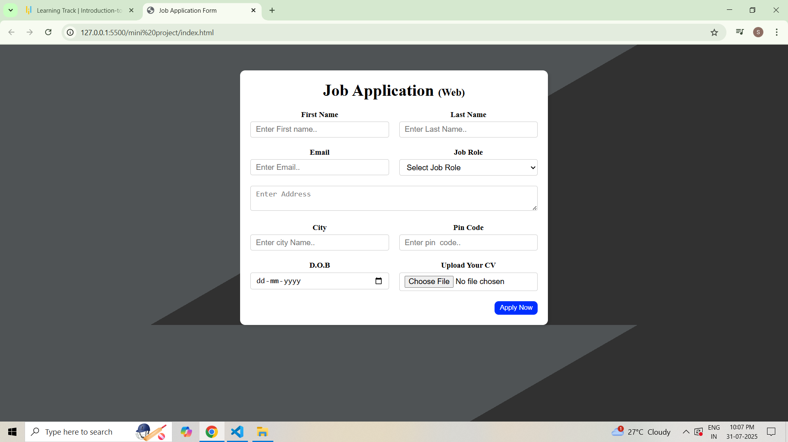

# Job Application Form

A mini project of a Job Application Form built using HTML, CSS, and JavaScript.

## 🚀 Features
- Input fields for personal details (name, email, phone)
- Dropdown menus for education and work experience
- Radio buttons and checkboxes for easy selection
- Responsive design

## 🛠 Technologies Used
- HTML5
- CSS3


## 📷 Screenshot
Here’s how the form looks:



## 🌐 Live Demo
[Click here to view the form](https://Saniya-coder2006.github.io/job-application-form/)

## 📌 How to Run Locally
1. Clone this repository:
   ```bash
 git clone https://github.com/Saniya-coder2006/git/ 